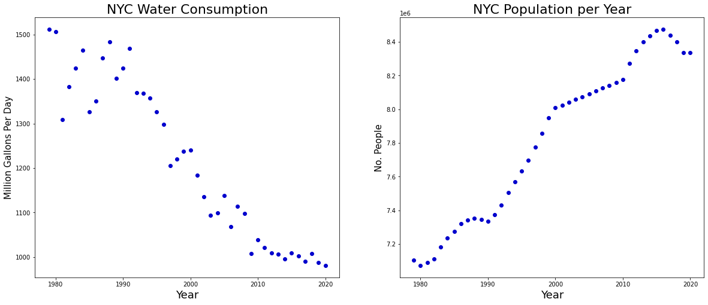
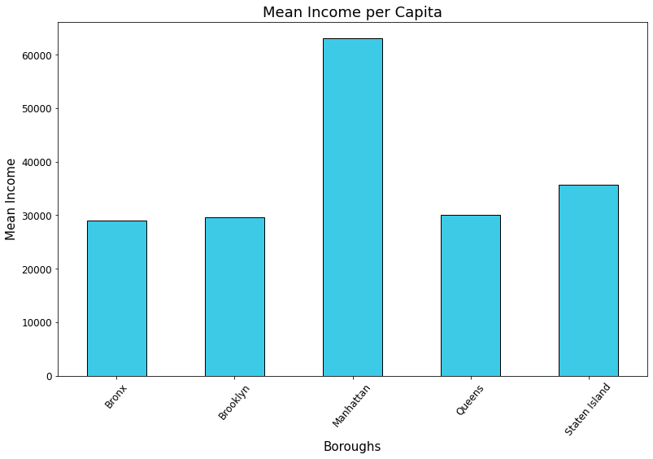
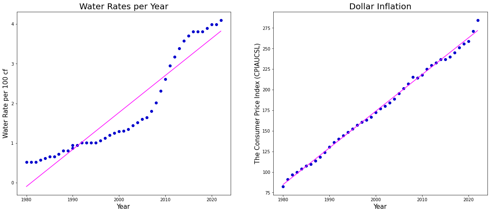
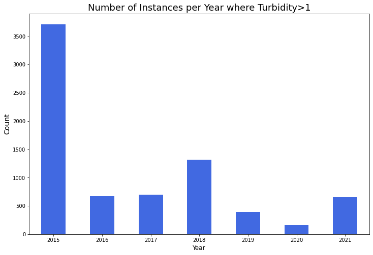
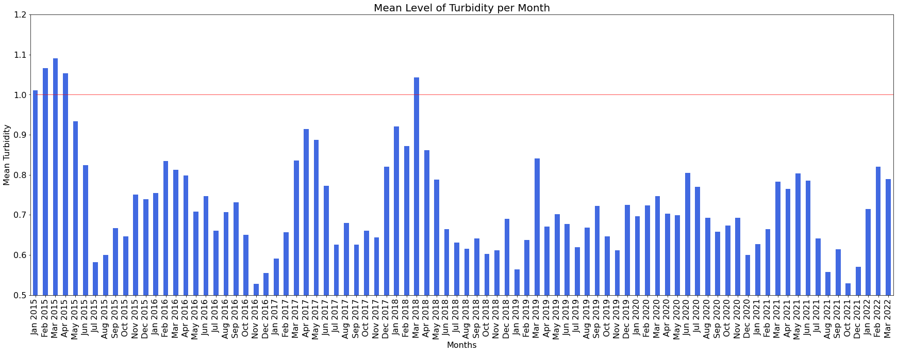
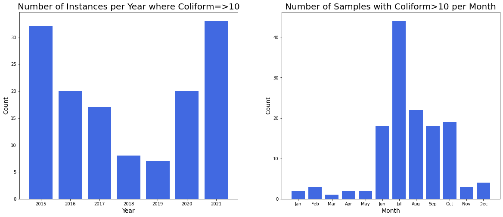

# Water in New York City

Today we are presented with new challenges associated with climate change, maintenance and enhancement of current conservation measures and continuing demands for economic development in upstate watershed communities [[1]](https://www.researchgate.net/publication/228436399_Water_supply_management_of_the_New_York_Metropolitan_area_and_future_challenges_from_population_growth_and_global_climate_change). Water is one of the world’s most precious resources – but as the planet’s climate changes and the population rises, up to 5.7 billion people could be living in areas where water is scarce for at least one month a year by 2050. That’s why companies and individuals are exploring ways of saving this life-giving liquid [[2]](https://www.henkel.com/spotlight/2020-03-20-saving-water-and-tackling-climate-change-1046204).

The NYC Watershed is an area of over 2,000 square miles. It drains its rainwater and snowmelt into 19 reservoirs and 3 controlled lakes, providing over 1 billion gallons of clean drinking water to more than 9 million New Yorkers every day. Over half the population of New York [[3]](https://mywoodlot.com/)!

In the preceding sections we will explore how water consumption has changed as the population increases in New York, the quality of the water and where the bad water samples are distributed throughout the city, and much more! So keep on reading!

## Why New York?
New York City has one of the largest surface water supply systems in the US and has the highest population density of any major city in the US [[4]](https://www1.nyc.gov/site/planning/planning-level/nyc-population/population-facts.page). It is also committed to providing high quality drinking water to residents and visitors. As an example between the years 2015 and 2025, New York aims to install or repair 500 water fountains and water bottle refilling stations to encourage proper hydration [[5]](https://portal.311.nyc.gov/article/?kanumber=KA-03088).

# Water Consumption in New York City

We began by investigating basic aspects of water consumption in New York. Over the years 1980-2021 we notice a downwards trend for water consumption although the population increases. How may this be? We will do further analysis of various NYC data, exploring the water consumption of different boroughs and relate that with social aspects such as income. We will also look further into the quality of water and water rates.

## Water Consumption and Population Growth

Before we dive deeper into water in New York we wanted to investigate the associations between water consumption and population growth per year. To do that a machine learning strategy called *Linear Regression* was used to fit a line between our datapoints. When referring to water, the unit *MGD* refers to millions of gallons per day. From the figure in tab 1 below it is evident that there is a linear decline in water consumption with coefficient of determination . The coefficient being close to 1 means that there is a strong relation between water consumption and years which supports our assumption. Additionally, looking at the population growth (tab 2) it seems that there is a linear increase, although in general population growth is a common example of exponential growth, but that is in an ideal environment [[6]](https://www.britannica.com/science/population-ecology/Logistic-population-growth). The model had , even better than the fit for the water consumption, which indicates that in New York the population growth is highly dependent on the years and is increasing at a fast rate according to the figure! This will definitely be an issue in the future because as we mentioned above New York has the highest population density of any major city in the US. 

Another interesting thing we noticed was that there is a strong relationship between the large increase in population and decrease in water consumption, see tab 3. This is suprising as a rise in population leads to higher demand for water. The decrease in water consumption could be due to other factors such as improvements in technology, i.e. water-efficient taps, toilets, showerheads, and appliances that can significantly reduce water usage [[7]](https://www.yourhome.gov.au/water/reducing-water-use).

<iframe src="LinearFitWaterConsumption.html"
    sandbox="allow-same-origin allow-scripts"
    width="100%"
    height="600"
    scrolling="no"
    seamless="seamless"
    frameborder="0">
</iframe>

## New York City Demographics

New York city is composed of five boroughs, Bronx, Brooklyn, Manhattan, Queens, and Staten Island. In the map below we can see how the boroughs are positioned. With the establishment of modern New York City in 1898, all five boroughs came into existence. We will compare statistics between boroughs of New York City with data analysis and visualizations.

<iframe src="Borough.html"
    sandbox="allow-same-origin allow-scripts"
    width="120%"
    height="600"
    scrolling="no"
    seamless="seamless"
    frameborder="0">
</iframe>

The population density in New York is visualized in the map below where lighter colors represent areas of low population density and darker colors represent areas of high population density. On the map we see that the highest population density is in Manhattan, more spesifically in the Upper East Side of Manhattan.

<iframe src="dens.html"
    sandbox="allow-same-origin allow-scripts"
    width="120%"
    height="700"
    scrolling="no"
    seamless="seamless"
    frameborder="0">
</iframe>

Now let’s analyze the difference in people's income per borough. The dataset contained information about income per capita in each borough-block-bot (BBL) and from this we could calculate the mean income per capita in each borough. It seems that the Bronx, Brooklyn and Queens have similar incomes whereas the people of Staten Island have a bit more and people from Manhattan have considerably more income.

## Drinking Fountains Positions

As previously stated, one of NYC goals was to install or repair 500 water fountains and water bottle refilling stations to encourage proper hydration. Out of curiosity we plotted the location of New York’s water fountains. From the geo-plot we can see that the fountains are very evenly distributed. Most of them seem to lie by the sea and in public parks. This seems reasonable as those places tend to be popular areas for running.

<iframe src="test.html"
    sandbox="allow-same-origin allow-scripts"
    width="100%"
    height="600"
    scrolling="no"
    seamless="seamless"
    frameborder="0">
</iframe>

## Multifamily Housing in the Boroughs

Local Law 84 requires owners of large residential and commercial buildings in the five boroughs of New York to submit annual energy and water consumption reports to the city [[8]](https://www.wegowise.com/compliance/new-york-city-local-law-84). Looking into multifamily housing between the years 2015 to 2020 we notice the decreasing trend in water consumption in most of the boroughs in the figure below, except in Queens. Notice that between the years 2019 and 2020 there was a sudden increase in water consumption during the Covid-19 pandemic in some boroughs. This makes sense as people were staying more indoors at home and statistical tests showed that our observations are significant for Bronx and Queens which means the increase is unlikely due to chance. Covid-19 definitely had an impact! The increase was also quite high compared to other changes throughout the years. Additionally, according to the statistics, the Bronx borough has the highest poverty rate in New York, around 30% [[9]](https://mycrains.crainsnewyork.com/stats-and-the-city/2013/bronx/the-poorest-borough/). One would assume that there would be a distinct difference in water consumption between the boroughs based on the poverty rate but that does not seem to be the case here.

<iframe src="MedianWaterperBoroughMultFam.html"
    sandbox="allow-same-origin allow-scripts"
    width="100%"
    height="700"
    scrolling="no"
    seamless="seamless"
    frameborder="0">
</iframe>
 
 
## Water Rates
Could increased water rates be one of the reasons behind the decrease in water consumption in New York? Looking at the leftmost graph, we can see an obvious upwards trend in water rates over the years 1980 to 2021. This does not come as a surprise as the dollar inflation increases every year as well. But does it increase more rapidly than the dollar inflation? Looking at the two graphs side by side their fitted slopes, implemented with the aforementioned *Linear Regression*, seem to be very equal. We can obtain the slope coefficient , which can be interpreted as:  +  ( being the intercept) to see if the two slopes are equal. This must be done on standardized data as the scales of the y-axis are very different for the two graphs. Standardizing means transforming the data such that the mean becomes 0 and the variance becomes 1. Using *Linear Regression* we could see that the slope for the water rates is 0.9443 and for inflation is 0.9984. This tells us that water rates increase at a slightly lower rate than inflation, with a difference of 0.0540. 

## Water Quality

New York’s drinking water is considered safe to drink. However, to be on the safe side using a water filter is recommended. New York actually has one of the cleanest drinking water in the US [[10]](https://tappwater.co/us/can-you-drink-nyc-tap-water/). New York’s water quality scientists collect water samples from up to 546 locations. Street-side drinking water sampling stations allow them to sample the water at the endpoint of the city’s distribution system, just before it enters the local service line that connects to buildings [[11]](https://www1.nyc.gov/site/dep/water/water-monitoring.page).

The water quality dataset contains 112,463 samples which are daily samples obtained from New York’s sample sites over the years 2015 to the present day. The sampling sites can be seen on the geo-map below. The sampling sites are well distributed, having more sites where the population density is more.

<iframe src="samplingsites2.html"
    sandbox="allow-same-origin allow-scripts"
    width="100%"
    height="600"
    scrolling="no"
    seamless="seamless"
    frameborder="0">
</iframe>

The following parameters were tested and their recommended values from World Health Organization and EPA are the following 
[[12]](https://www.kaggle.com/code/aashaymaheshwari/evaluating-drinking-water-quality-of-new-york-city#Data):

- `Residual Free Chlorine (mg/L)` - The maximum allowable WHO value for free chlorine residual in drinking water is 5 mg/L.

- `Turbidity (NTU)` - The US Environmental Protection Agency sets the maximum level of turbidity in finished drinking water at 1 NTU.

- `Fluoride (mg/L)` - The US Environmental Protection Agency (EPA) has set a maximum amount of fluoride allowable in drinking water of 4.0 mg/L.

- `Coliform (Quanti-Tray) (MPN /100mL)` - No sample should contain more than 10 coliform organisms per 100 ml.

- `E.coli(Quanti-Tray) (MPN/100mL)` - E. coli levels at designated swimming beaches should not exceed 88 per 100 milliliter (mL) in any one sample, or exceed a three-sample geometric mean average over a 60-day period of 47/100 mL.

The amount of bad samples (samples which exceed the maximum value) were counted. The results were the following: 

| Chemical | Number of bad samples |
| ------------- | ------------- |
| Residual Free Chlorine   | 0 |
| Turbidity  | 7638  |
| Fluoride   | 0 |
| Coliform   | 137|
| E.coli   | 0|

### Turbidity

We will look further into instances where turbidity>1. The dataset contains 7689 samples with turbidity over the allowed limit. From the graph it can be seen that turbidity instances seem to have been unusually high in 2015.

 

When we look at the instances per month, we can see that the mean turbidity per month exceeds the allowed value four times in 2015 and once in 2018. Too much water turbidity can have bad repercussions since too much turbidity can lead to gastrointestinal diseases [[13]](https://www.eldoradosprings.com/blog/lets-talk-turbidity-in-water).  Studies have shown that there might be a relationship between drinking water turbidity and emergency department visits for gastrointestinal illnesses [[14]](https://www.ncbi.nlm.nih.gov/pmc/articles/PMC4412479/). 

 

### Coliform

Now we'll look further into coliform. The number of bad coliform samples are much rarer than of turbidity, having 138 bad samples in the dataset. As for turbidity the number of bad samples peak in 2015, but also in 2021. From the monthly distribution we can see the highest peaks seem to happen in the summer months, July and August. A reason for this might be because coliform can enter well water through garden hoes, which are likely more often used during summertime. Too much coliform level can cause an upset stomach, vomiting, fever or diarrhea [[15]](https://www.michigan.gov/documents/deq/deq-wd-gws-wcu-coliformbactiwellwatersampling_270604_7.pdf).

But where are bad samples most often detected? The heatmap shows where most of the bad samples (where turbidity>1 or when coliform>=10) are detected. We can see that the highest number of bad samples were detected in the Bronx borough. As previously stated, the Bronx borough has the highest poverty rate. Could this be one of the reasons behind increasing values of bad samples being detected in the Bronx? Perhaps the pipes and plumbing in the Bronx are of lower quality than elsewhere because of the poverty rate causing an increased chance of Turbidity and Coliform getting into the pipes. For example coliform can get into wet water if septic systems are poorly maintained [[15]](https://www.michigan.gov/documents/deq/deq-wd-gws-wcu-coliformbactiwellwatersampling_270604_7.pdf). Before making any assumptions we must remember what we saw before, there are more sampling stations in the Bronx compared to some of the other boroughs.

<iframe src="heatmapbad.html"
    sandbox="allow-same-origin allow-scripts"
    width="100%"
    height="600"
    scrolling="no"
    seamless="seamless"
    frameborder="0">
</iframe>

Now let's look at spatial patterns of the bad samples per year. Looking at the data year by year we dont see a huge difference in boroughs. We can see that the highest number of bad samples were detected in 2015. In 2020 there seems to be low activity. Could that be related to Covid-19? Perhaps New York's water quality scientists were in quarantine.

<iframe src="movie.html"
    sandbox="allow-same-origin allow-scripts"
    width="100%"
    height="600"
    scrolling="no"
    seamless="seamless"
    frameborder="0">
</iframe>

## Water Complaints

We will explore the number of water complaints per year and borough. The complaints were of various types, for example, “cloudy or milky water”, “oil, grease in water”, “taste/odor” etc. To make sure the results weren’t biased because of population we divided the number of complaints with the number of people in each borough. From the heat map of bad samples we could see that most bad samples were detected around Bronx. This is interesting as most water complaints come from Manhattan and one of the least complaints were from the Bronx. We already saw that the people of Manhattan have the highest income out of the five boroughs. Analysis about consumer behavior states that consumers with higher income tend to complain more often [[16]](https://www.acrwebsite.org/volumes/6691/volumes/v14/NA-14). 

<iframe src="Complaints.html"
    sandbox="allow-same-origin allow-scripts"
    width="100%"
    height="600"
    scrolling="no"
    seamless="seamless"
    frameborder="0">
</iframe>

# Conclusion

Now we’ve analyzed and discovered intriguing facts about water in New York. In summary, from our analysis we saw that there was a strong correlation between population size and water consumption. It became clear that an increase in water rates is likely not one of the causes of the decrease in water consumption in New York and we saw an increase in water consumption in most of the five boroughs during Covid-19! The highest number of bad water samples were in the Bronx which was an interesting result as the Bronx has the highest poverty rate out of all the boroughs. Surprisingly, people in Manhattan complain more frequently about their water than other boroughs, despite there being few bad water samples detected. An analysis from *ACR* on consumer behavior verified that this is a common behavior amongst consumers with higher income [[16]](https://www.acrwebsite.org/volumes/6691/volumes/v14/NA-14/full). 

After doing some online research it was found that the real reason behind NYC's decreased water consumption is the installation of new toilets which consume much less water per flush than before. Also, the city has worked towards eliminating waste in the infrastructure that supplies water to buildings. NYC has about 7,000 miles of sub-surface water main infrastructure. The vast network consists of aging pipes that are prone to developing leaks. The City uses sonar and other technology to find the leaks, and it has achieved an average estimated savings of 1.89 million gallons per day from repairing them [[17]](https://www.hannahkates.com/nyc-water/). It could also be that in modern times people have become increasingly aware of saving water in relation to climate change. For example, showering for a shorter time reduces CO2 emissions by cutting the amount of energy needed to heat water [[2]](https://www.henkel.com/spotlight/2020-03-20-saving-water-and-tackling-climate-change-1046204).

# References

[1]	Y. Gorokhovich and V. Goldsmith, “Water supply management of the New York Metropolitan area and future challenges from population growth and global climate change,” IAHS-AISH Publ., vol. 327, Nov. 2008.

[2] Henkel, “Saving water and tackling climate change.”  [Online]. Available: https://www.henkel.com/spotlight/2020-03-20-saving-water-and-tackling-climate-change-1046204. [Accessed: April 22, 2022].

[3]	“My Woodlot - Care for and enjoy your woods.”  [Online]. Available: https://mywoodlot.com/. [Accessed: April 30, 2022].

[4]	“Planning-Population-NYC Population Facts - DCP.”  [Online]. Available: https://www1.nyc.gov/site/planning/planning-level/nyc-population/population-facts.page. [Accessed: May 01, 2022].

[5]	“Water Fountain and Bottle Refill Stations · NYC311.”  [Online]. Available: https://portal.311.nyc.gov/article/?kanumber=KA-03088. [Accessed: April 22, 2022].

[6] “Population ecology - Logistic population growth. Britannica.”  [Online]. Available: https://www.britannica.com/science/population-ecology/Logistic-population-growth. [Accessed: May 08, 2022]

[7]	“Reducing water use. YourHome.”  [Online]. Available: https://www.yourhome.gov.au/water/reducing-water-use. [Accessed: May 01, 2022].

[8] “New York City Local Law 84 - LL84 Compliance. WegoWise.”  [Online]. Available: https://www.wegowise.com/compliance/new-york-city-local-law-84. [Accessed: April 23, 2022].

[9] “The poorest borough Stats and the City.”  [Online]. Available: https://mycrains.crainsnewyork.com/stats-and-the-city/2013/bronx/the-poorest-borough/. [Accessed: May 08, 2022].

[10] “Can you drink NYC tap water?,” USA, Feb. 07, 2020.  [Online]. Available: https://tappwater.co/us/can-you-drink-nyc-tap-water/. [Accessed: May 01, 2022],

[11] “Water Monitoring - DEP.”  [Online]. Available: https://www1.nyc.gov/site/dep/water/water-monitoring.page. [Accessed: May 07, 2022].

[12] “Evaluating drinking water quality of New York city. Kaggle.”  [Online]. Available: https://www.kaggle.com/code/aashaymaheshwari/evaluating-drinking-water-quality-of-new-york-city#Data. [Accessed: May 01, 2022].

[13] J. Martin, “Let’s Talk Turbidity in Water.”  [Online]. Available: https://www.eldoradosprings.com/blog/lets-talk-turbidity-in-water. [Accessed: May 04, 2022].

[14] J. L. Hsieh, T. Q. Nguyen, T. Matte, and K. Ito, “Drinking Water Turbidity and Emergency Department Visits for Gastrointestinal Illness in New York City, 2002-2009,” PLoS ONE, vol. 10, no. 4, p. e0125071, Apr. 2015, doi: 10.1371/journal.pone.0125071.

[15] “Coliform Bacteria in Drinking Water for Well Owners,” p. 2.

[16] M. A. Morganosky and H. M. Buckley, “Complaint Behavior: Analysis By Demographics, Lifestyle, and Consumer Values,” ACR North Am. Adv., vol. NA-14, 1987 [Online]. Available: https://www.acrwebsite.org/volumes/6691/volumes/v14/NA-14/full. [Accessed: May 02, 2022].

[17]	H. Kates, “NYC’s Remarkable Decline in Water Consumption.”  [Online]. Available: http://www.hannahkates.com/nyc-water. [Accessed: May 02, 2022].

