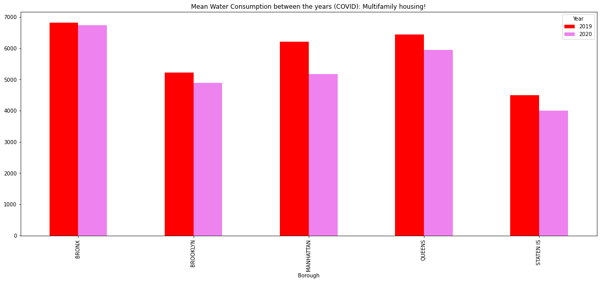

# Water in New York City

Today we are presented with new challenges associated with climate change, maintenance and enhancement of current conservation measures and continuing demands for economic development in upstate watershed communities.  

Water is one of the world’s most precious resources – but as the planet’s climate changes and the population rises, up to 5.7 billion people could be living in areas where water is scarce for at least one month a year by 2050. That’s why companies and individuals are exploring ways of saving this life-giving liquid.

The NYC Watershed is an area of over 2,000 square miles. It drains its rainwater and snowmelt into 19 reservoirs and 3 controlled lakes, providing over 1 billion gallons of clean drinking water to more than 9 million New Yorkers every day. Over half the population of New York! (https://mywoodlot.com/item/the-new-york-city-watershed-explained)

In the preceding sections we will explore how water consumption has changed as the population increases in New York City. 

> *Why New York?*
> New York City has one of the largest surface water supply systems in the US. It is also committed to providing high quality drinking water to residents and visitors. As an example between the years 2015 and 2025, New York aims to install or repair 500 water fountains and water bottle refilling stations to encourage proper hydration

Data was collected from ... 


# Water Consumption in the City of New York

# Geomap
<iframe src="GeomapTest.html"
    sandbox="allow-same-origin allow-scripts"
    width="100%"
    height="600"
    scrolling="no"
    seamless="seamless"
    frameborder="0">
</iframe>

## Multifamily Housing

<iframe src="meanWaterperBoroughMultFam.html"
    sandbox="allow-same-origin allow-scripts"
    width="100%"
    height="600"
    scrolling="no"
    seamless="seamless"
    frameborder="0">
</iframe>


## Has COVID19 had an impact on water consumption?
  


```diff
- text in red
+ text in green
! text in orange
# text in gray
@@ text in purple (and bold)@@
```

## Here is a test photo for New York data


## Welcome to GitHub Pages

You can use the [editor on GitHub](https://github.com/sarajosephs/ProjectB/edit/gh-pages/index.md) to maintain and preview the content for your website in Markdown files.

Whenever you commit to this repository, GitHub Pages will run [Jekyll](https://jekyllrb.com/) to rebuild the pages in your site, from the content in your Markdown files.


### Markdown

Markdown is a lightweight and easy-to-use syntax for styling your writing. It includes conventions for

```markdown
Syntax highlighted code block

# Header 1
## Header 2
### Header 3

- Bulleted
- List

1. Numbered
2. List

**Bold** and _Italic_ and `Code` text

[Link](url) and 
```

For more details see [Basic writing and formatting syntax](https://docs.github.com/en/github/writing-on-github/getting-started-with-writing-and-formatting-on-github/basic-writing-and-formatting-syntax).

### Jekyll Themes

Your Pages site will use the layout and styles from the Jekyll theme you have selected in your [repository settings](https://github.com/sarajosephs/ProjectB/settings/pages). The name of this theme is saved in the Jekyll `_config.yml` configuration file.

### Support or Contact

Having trouble with Pages? Check out our [documentation](https://docs.github.com/categories/github-pages-basics/) or [contact support](https://support.github.com/contact) and we’ll help you sort it out.
