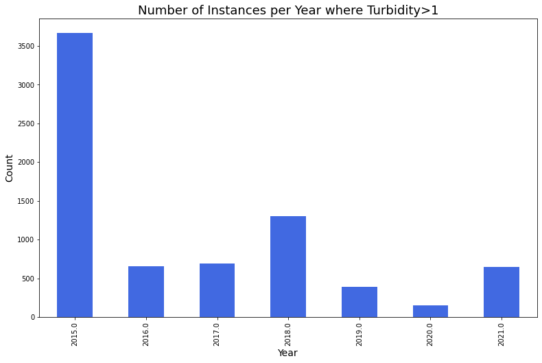

# Water in New York City

Today we are presented with new challenges associated with climate change, maintenance and enhancement of current conservation measures and continuing demands for economic development in upstate watershed communities.  

Water is one of the world’s most precious resources – but as the planet’s climate changes and the population rises, up to 5.7 billion people could be living in areas where water is scarce for at least one month a year by 2050. That’s why companies and individuals are exploring ways of saving this life-giving liquid.

The NYC Watershed is an area of over 2,000 square miles. It drains its rainwater and snowmelt into 19 reservoirs and 3 controlled lakes, providing over 1 billion gallons of clean drinking water to more than 9 million New Yorkers every day. Over half the population of New York! (https://mywoodlot.com/item/the-new-york-city-watershed-explained)

In the preceding sections we will explore how water consumption has changed as the population increases in New York City. 


## Why New York?
New York City has one of the largest surface water supply systems in the US. It is also committed to providing high quality drinking water to residents and visitors. As an example between the years 2015 and 2025, New York aims to install or repair 500 water fountains and water bottle refilling stations to encourage proper hydration


Data was collected from ... 


# Water Consumption in the City of New York

We began by investigating basic aspects of water consumption in New York. 


The figure above is interesting. Over the years 1980-2021 we notice a downwards trend for water consumption although the population increases. How may this be? We will do further analysis of various NYC data, exploring the water consumption of different boroughs and relate that with social aspects such as income and race. We will also look further into the quality of water and water rates to see if that might be one of the reasons for the decrease in water consumption. 

## Is there a linear trend between water consumption and population growth? Is there a trend between the years?

We wanted to investigate if there is a linear decline in water consumption as can be inferred from the graphs above. A machine learning strategy called *Linear Regression* was used to see if there is an association/correlation between population and the years and water consumption and the years. When referring to water, the unit *MGD* refers to millions of gallons per day. From the figure in tab 1 below it is evident that there is a linear decline in water consumption with coefficient of determination . The coefficient being close to 1 means that there is a strong relation between water consumption and years which supports our assumption. Additionally, looking at the population growth (tab 2) it seems that there is a linear increase, although in general population growth is a common example of exponential growth, but that is in an ideal environment [Reference](https://www.britannica.com/science/population-ecology/Logistic-population-growth). The model had , even better than the fit for the water consumption, which indicates that in New York the population growth is highly dependent on the years and is increasing at a fast rate! ?? of scientific?. Another interesting thing we noticed was that there is a strong relationship between the large increase in population and decrease in water consumption, see tab 3.


<iframe src="LinearFitWaterConsumption.html"
    sandbox="allow-same-origin allow-scripts"
    width="100%"
    height="600"
    scrolling="no"
    seamless="seamless"
    frameborder="0">
</iframe>


# Geomap
<iframe src="GeomapTest.html"
    sandbox="allow-same-origin allow-scripts"
    width="100%"
    height="600"
    scrolling="no"
    seamless="seamless"
    frameborder="0">
</iframe>

# Drinking Fountains position

<iframe src="test.html"
    sandbox="allow-same-origin allow-scripts"
    width="100%"
    height="600"
    scrolling="no"
    seamless="seamless"
    frameborder="0">
</iframe>


## Multifamily Housing

Local Law 84 requires owners of large residential and commercial buildings in the five boroughs of New York to submit annual energy and water consumption reports to the City [Reference](https://www.wegowise.com/compliance/new-york-city-local-law-84). Looking into multifamily housing between the years 2015 to 2020 we notice the decreasing trend in water consumption in the boroughs in the figure below. Notice that between the years 2019 and 2020 there was a sudden increase in water consumption during the Covid-19 pandemic in some boroughs. This makes sense as people were staying more indoors at home and statistical tests showed that our observations are significant for Bronx and Queens which means the increase is unlikely due to chance. Covid-19 definitely had an impact! The increase was also quite high compared to other changes throughout the years. 


<iframe src="MedianWaterperBoroughMultFam.html"
    sandbox="allow-same-origin allow-scripts"
    width="120%"
    height="700"
    scrolling="no"
    seamless="seamless"
    frameborder="0">
</iframe>


## What about the impacts of Covid19?
 
 
## Water rates
Let’s look at how water rates have increased throughout the years. 


We see an upwards trend for the water rates but this could be in accordance to dollar inflation. Looking at the inflation graph we see an upwards trend also. To compare the two slopes both data had to be standardized to have a mean=0 and variance=1. Using sklearn’s Linear Regression we could see that the slope for the water rates is 0.9984 and for inflation is 0.9443. This tells us that water rates increase at a slightly higher rate than inflation, with a difference of 0.0540. 

## Water quality

Each month, New York’s water quality scientists collect more than 1,300 water samples from up to 546 locations. Street-side drinking water sampling stations allow them to sample the water at the end point of the city’s distribution system, just before it enters the local service line that connects to buildings. [Reference](https://www1.nyc.gov/site/dep/water/water-monitoring.page)

The water quality dataset contains 112,463 samples which are monthly samples obtained from New York’s sample sites over the years 2015 to present day. The sampling can bee seen on the geo-map below:


<iframe src="samplingsites.html"
    sandbox="allow-same-origin allow-scripts"
    width="100%"
    height="600"
    scrolling="no"
    seamless="seamless"
    frameborder="0">
</iframe>


The following parameters are tested and their recommended values from World Health Organization and EPA are the following:

- `Residual Free Chlorine (mg/L)` - The maximum allowable WHO value for free chlorine residual in drinking water is 5 mg/L.

- `Turbidity (NTU)` - The US Environmental Protection Agency sets the maximum level of turbidity in finished drinking water at 1 NTU

- `Fluoride (mg/L)` - The US Environmental Protection Agency (EPA) has set a maximum amount of fluoride allowable in drinking water of 4.0 mg/L

- `Coliform (Quanti-Tray) (MPN /100mL)` - No sample should contain more than 10 coliform organisms per 100 ml

- `E.coli(Quanti-Tray) (MPN/100mL)` - E. coli levels at designated swimming beaches should not exceed 88 per 100 milliliter (mL) in any one sample, or exceed a three-sample geometric mean average over a 60-day period of 47/100 mL

[Reference](https://www.kaggle.com/code/aashaymaheshwari/evaluating-drinking-water-quality-of-new-york-city#Data)

The amount of bad samples (samples which exceed the maximum value) were counted. The results were the following: 

| Chemical | Number of bad samples |
| ------------- | ------------- |
| Residual Free Chlorine   | 0 |
| Turbidity  | 7689  |
| Fluoride   | 0 |
| Coliform   | 138|
| E.coli   | 0|


We will look further into instances where turbidity>1. The dataset contains 7689 samples with turbidity over the allowed limit. From the graph it can be seen that turbidity instances seem to have been unusually high in 2015.


 


When we look at the instances per month, we can see that the mean turbidity per month exceeds the allowed value four times in 2015 and once in 2018. Too much water turbidity can have bad repercussions since too much turbidity can lead to gastrointestinal diseases [Reference](https://www.eldoradosprings.com/blog/lets-talk-turbidity-in-water).  Studies have shown that there might be a relationship between drinking water turbidity and emergency department visits for gastrointestinal illnesses [Reference](https://www.ncbi.nlm.nih.gov/pmc/articles/PMC4412479/). 


 


Now we'll look further into coliform. The number of bad coliform samples are much rarer than of turbidity, having 138 bad samples in the dataset. 


As for turbidity the number of bad samples peak in 2015, but also in 2021. From the monthly distribution we can see the highest peaks seem to happen in the summer months, July and August. A reason for this might be because coliform can enter well water through garden hoes, which are likely more often used in the summertime. Too much coliform level can cause an upset stomach, vomiting, fever or diarrhea. [Reference](https://www.michigan.gov/documents/deq/deq-wd-gws-wcu-coliformbactiwellwatersampling_270604_7.pdf).


But where are bad samples most often detected? Let's look at the spatial patterns of the bad samples. The heatmap shows where most of the bad samples (where turbidity>1 or when coliform>=10) are detected.

<iframe src="heatmap_badsamples.html"
    sandbox="allow-same-origin allow-scripts"
    width="100%"
    height="600"
    scrolling="no"
    seamless="seamless"
    frameborder="0">
</iframe>

We can see that the most bad samples were detected in the Bronx borough and also in Staten Island.


## Water complaints


```diff
- text in red
+ text in green
! text in orange
# text in gray
@@ text in purple (and bold)@@
```

## Here is a test photo for New York data


## Welcome to GitHub Pages

You can use the [editor on GitHub](https://github.com/sarajosephs/ProjectB/edit/gh-pages/index.md) to maintain and preview the content for your website in Markdown files.

Whenever you commit to this repository, GitHub Pages will run [Jekyll](https://jekyllrb.com/) to rebuild the pages in your site, from the content in your Markdown files.


### Markdown

Markdown is a lightweight and easy-to-use syntax for styling your writing. It includes conventions for

```markdown
Syntax highlighted code block

# Header 1
## Header 2
### Header 3

- Bulleted
- List

1. Numbered
2. List

**Bold** and _Italic_ and `Code` text

[Link](url) and 
```

For more details see [Basic writing and formatting syntax](https://docs.github.com/en/github/writing-on-github/getting-started-with-writing-and-formatting-on-github/basic-writing-and-formatting-syntax).
 
### Jekyll Themes

Your Pages site will use the layout and styles from the Jekyll theme you have selected in your [repository settings](https://github.com/sarajosephs/ProjectB/settings/pages). The name of this theme is saved in the Jekyll `_config.yml` configuration file.

### Support or Contact

Having trouble with Pages? Check out our [documentation](https://docs.github.com/categories/github-pages-basics/) or [contact support](https://support.github.com/contact) and we’ll help you sort it out.
