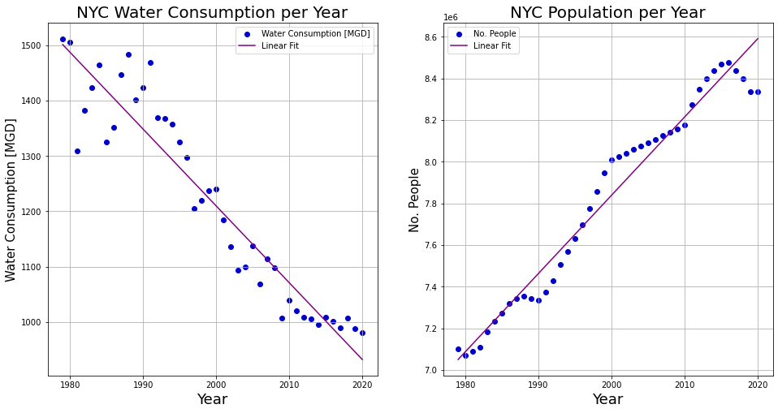
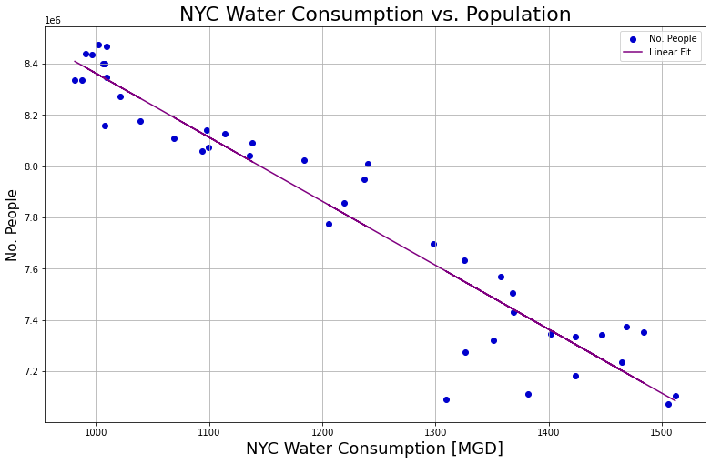

# Water in New York City

Today we are presented with new challenges associated with climate change, maintenance and enhancement of current conservation measures and continuing demands for economic development in upstate watershed communities.  

Water is one of the world’s most precious resources – but as the planet’s climate changes and the population rises, up to 5.7 billion people could be living in areas where water is scarce for at least one month a year by 2050. That’s why companies and individuals are exploring ways of saving this life-giving liquid.

The NYC Watershed is an area of over 2,000 square miles. It drains its rainwater and snowmelt into 19 reservoirs and 3 controlled lakes, providing over 1 billion gallons of clean drinking water to more than 9 million New Yorkers every day. Over half the population of New York! (https://mywoodlot.com/item/the-new-york-city-watershed-explained)

In the preceding sections we will explore how water consumption has changed as the population increases in New York City. 


> *Why New York?*
> New York City has one of the largest surface water supply systems in the US. It is also committed to providing high quality drinking water to residents and visitors. As an example between the years 2015 and 2025, New York aims to install or repair 500 water fountains and water bottle refilling stations to encourage proper hydration

Data was collected from ... 

Aníta

# Water Consumption in the City of New York


## Is there a linear trend between water consumption and population growth? Is there a trend between the years?

We wanted to investigate if there is a linear decline in water consumption as can be inferred from the graphs above (ef það eru gröf fyrir ofan frá Helgu). A machine learning strategy called *Linear Regression* was used to see if there is an association/correlation between population and the years and water consumption and the years. When referring to water, the unit *MGD* refers to millions of gallons per day. From the left figure below it is evident that there is a linear decline in water consumption with coefficient of determination . The coefficient being close to 1 means that there is a strong relation between water consumption and years which supports our assumption. Additionally, looking at the population growth it seems that there is a linear increase, although in general population growth is a common example of exponential growth, but that is in an ideal environment [Reference](https://www.britannica.com/science/population-ecology/Logistic-population-growth). The model had , even better than the fit for the water consumption, which indicates that in New York the population growth is highly dependent on the years and is increasing at a fast rate! ?? of scientific?. Another interesting thing we noticed was that there is also a strong relationship between the large increase in population and decrease in water consumption which we explored above?? The reason for that..






# Geomap
<iframe src="GeomapTest.html"
    sandbox="allow-same-origin allow-scripts"
    width="100%"
    height="600"
    scrolling="no"
    seamless="seamless"
    frameborder="0">
</iframe>

# Drinking Fountains position

<iframe src="test.html"
    sandbox="allow-same-origin allow-scripts"
    width="100%"
    height="600"
    scrolling="no"
    seamless="seamless"
    frameborder="0">
</iframe>


## Multifamily Housing

Local Law 84 requires owners of large residential and commercial buildings in the five boroughs of New York to submit annual energy and water consumption reports to the City [Reference](https://www.wegowise.com/compliance/new-york-city-local-law-84). Looking into multifamily housing between the years 2015 to 2020 we notice the decreasing trend in water consumption in the boroughs in the figure below. Notice that between the years 2019 and 2020 there was a sudden increase in water consumption during the Covid-19 pandemic in some boroughs. This makes sense as people were staying more indoors at home and statistical tests showed that our observations are significant for Bronx and Queens which means the increase is unlikely due to chance. Covid-19 definitely had an impact! The increase was also quite high compared to other changes throughout the years. 

<iframe src="MedianWaterperBoroughMultFam.html"
    sandbox="allow-same-origin allow-scripts"
    width="110%"
    height="600"
    scrolling="no"
    seamless="seamless"
    frameborder="0">
</iframe>


## What about the impacts of Covid19?
 
 
## Water quality


```diff
- text in red
+ text in green
! text in orange
# text in gray
@@ text in purple (and bold)@@
```

## Here is a test photo for New York data


## Welcome to GitHub Pages

You can use the [editor on GitHub](https://github.com/sarajosephs/ProjectB/edit/gh-pages/index.md) to maintain and preview the content for your website in Markdown files.

Whenever you commit to this repository, GitHub Pages will run [Jekyll](https://jekyllrb.com/) to rebuild the pages in your site, from the content in your Markdown files.


### Markdown

Markdown is a lightweight and easy-to-use syntax for styling your writing. It includes conventions for

```markdown
Syntax highlighted code block

# Header 1
## Header 2
### Header 3

- Bulleted
- List

1. Numbered
2. List

**Bold** and _Italic_ and `Code` text

[Link](url) and 
```

For more details see [Basic writing and formatting syntax](https://docs.github.com/en/github/writing-on-github/getting-started-with-writing-and-formatting-on-github/basic-writing-and-formatting-syntax).
 
### Jekyll Themes

Your Pages site will use the layout and styles from the Jekyll theme you have selected in your [repository settings](https://github.com/sarajosephs/ProjectB/settings/pages). The name of this theme is saved in the Jekyll `_config.yml` configuration file.

### Support or Contact

Having trouble with Pages? Check out our [documentation](https://docs.github.com/categories/github-pages-basics/) or [contact support](https://support.github.com/contact) and we’ll help you sort it out.
